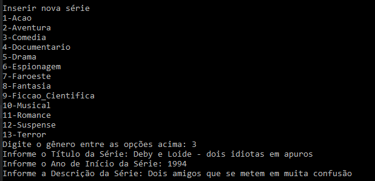
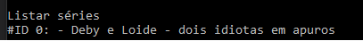
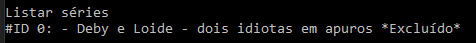
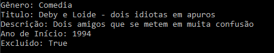

# Módulo Criando um APP simples de cadastro de séries em .NET da [DIO](https://digitalinnovation.one)

Foi criada uma aplicação de cadastro de séries, onde é possível listar, adicionar, excluir, atualizar e visualizar. As séries são armazenadas em um List, sem persistência dos dados.

A evolução desse aplicativo em relação ao anterior, de transferência bancária, é que aqui estamos utilizando uma classe de repositório, trabalhando com arquitetura em camadas, onde nessa classe ficam todos os métodos que interagem com nosso List. Também foi criado uma interface IRepositorio, implementada pela classe repositório SerieRepositorio, cuja interface contém os métodos que devem ser implementados, sem dizer como devem ser implementados.

Além disso, usamos um Enum de gêneros para facilitar na hora de cadastrar a série.

Também usamos uma classe abstrata chamada EntidadeBase com apenas um Id, para ser herdada pela classe Serie, para praticar a questão da herança.

Ao excluir uma série, apenas colocamos o atributo booleano Excluido da classe Serie como "true". Ao listarmos todas as séries, caso a série tenha sido excluída, será evidenciado com os dizeres "*Excluído*" ao final do nome na listagem.

Após excluir o ID = 0  

Visualizar a série ID=0 

